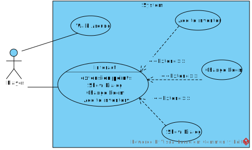

# Análise orientada a objeto
> [!NOTE]
> A **análise** orientada a objeto consiste na descrição do problema a ser tratado, duas primeiras etapas da tabela abaixo, a definição de casos de uso e a definição do domínio do problema.

## Descrição Geral do domínio do problema

> [!NOTE]
>Descrever de forma geral o domínio do problema.

O projeto é um jogo com 'câmera' isométrica, onde o jogador move seu personagem por salas investigando items e coletando chaves para abrir outras salas.

Para a estruturação dos passos futuros, foram decididas as [especificações](especificacoes.md) iniciais dos conteúdos do jogo.

> [!NOTE]
>Possíveis requisitos funcionais e não-funcionais podem ser elencados aqui.

## Diagrama de Casos de Uso

> [!NOTE]
>Apresentar o diagram de casos de uso, identificando as funcionalidades do sistema assim como os atores envolvidos

    

O diagrama apresenta como ator o jogador, este pode movimentar o personagem, no qual todo o processo de garantir movimento válido, realizar o mesmo e atualizar a tela é feito, assim como interagir com objetos, nessas interações dependendo da forma 3 tipos de eventos podem ocorrer, um diálogo, o item é deletado e adicionado ao inventário, ou uma mudança de sala.
 
## Diagrama de Domínio do problema

> [!NOTE]
>Elaborar um diagrama conceitual do domínio do problema.

[Retroceder](README.md) | [Avançar](projeto.md)

