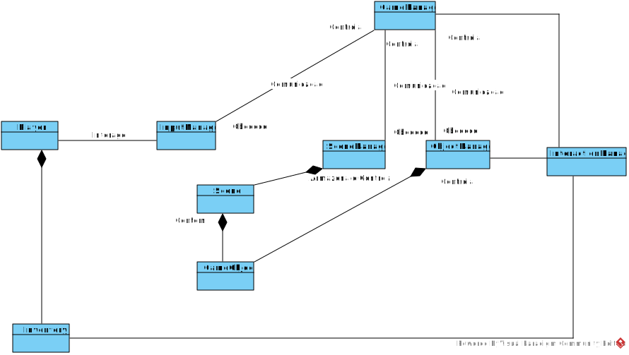

# Análise orientada a objeto

## Descrição Geral do domínio do problema

O projeto é um jogo com 'câmera' isométrica, onde o jogador move seu personagem por salas investigando items e coletando chaves para abrir outras salas.

Para a estruturação dos passos futuros, foram decididas as [especificações](especificacoes.md) iniciais dos conteúdos do jogo.

## Diagrama de Casos de Uso

    

O diagrama apresenta como ator o jogador, este pode movimentar o personagem, no qual todo o processo de garantir movimento válido, realizar o mesmo e atualizar a tela é feito, assim como interagir com objetos, nessas interações dependendo da forma 3 tipos de eventos podem ocorrer, um diálogo, o item é deletado e adicionado ao inventário, ou uma mudança de sala.
 
## Diagrama de Domínio do problema

    

[Retroceder](README.md) | [Avançar](projeto.md)

