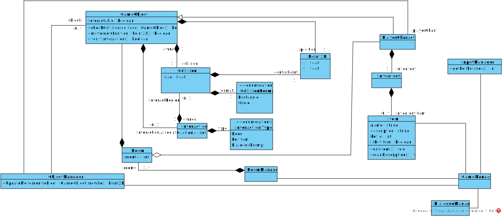
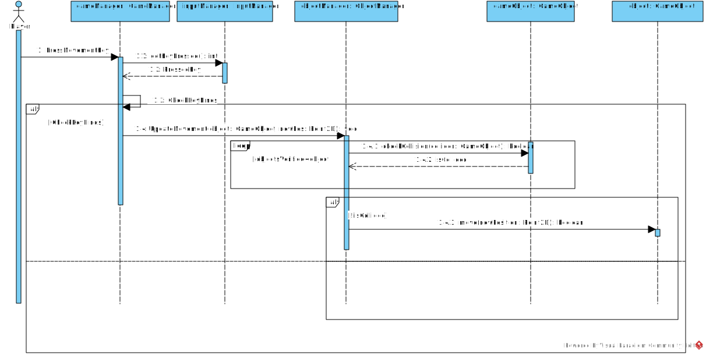

# Projeto orientado a objeto

>[!NOTE]
>O **Projeto orientado a objeto** é composto pelas documentação do projeto descrito em UML. Deve incluir um Diagrama de Classes do sistema projetado, e pelo menos um diagrama de interação de um dos casos de uso. Outros diagramas podem ser apresentados, caso julgue necessário.

Para o projeto, primeiro foi desenvolvido um diagrama de classes simples, tentando apontar os componentes necessários para a solução e estruturação do desejado pelos casos de uso.

    

Assim, para resolver os casos de uso, podemos analisar uma estrutura sequencial que mostra a forma que as classes se relacionam. No caso do caso de uso 'Walk Around', essa é a forma que foi estruturada para seu funcionamento.

    

[Retroceder](analise.md) | [Avançar](implementacao.md)

